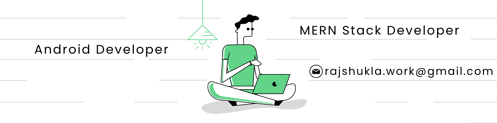

### Hi there 👋, RAJ SHUKLA
#### MERN and Android Developer

I'm an enthusiastic "Web and App Developer" with almost 3 years of experience. I've collaborated with others on numerous projects/hackathons and completed personal projects in MERN stack.
Coequally, I'm was involved in "Competitive Coding" with regularly participation in weekly and monthly competitions.
I believe in my personal philosophy that "If data is the FUEL, then we are the ENGINE".

Skills: MongoDB || ExpressJS || ReactJS || NodeJS || JavaScript|| Java || Python || C++ || C

 

  

   

  

